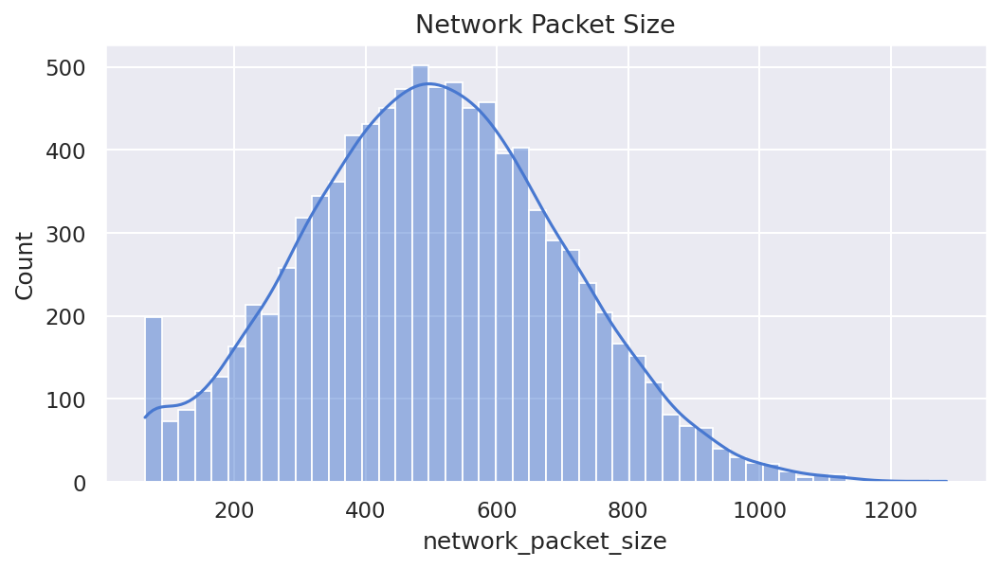
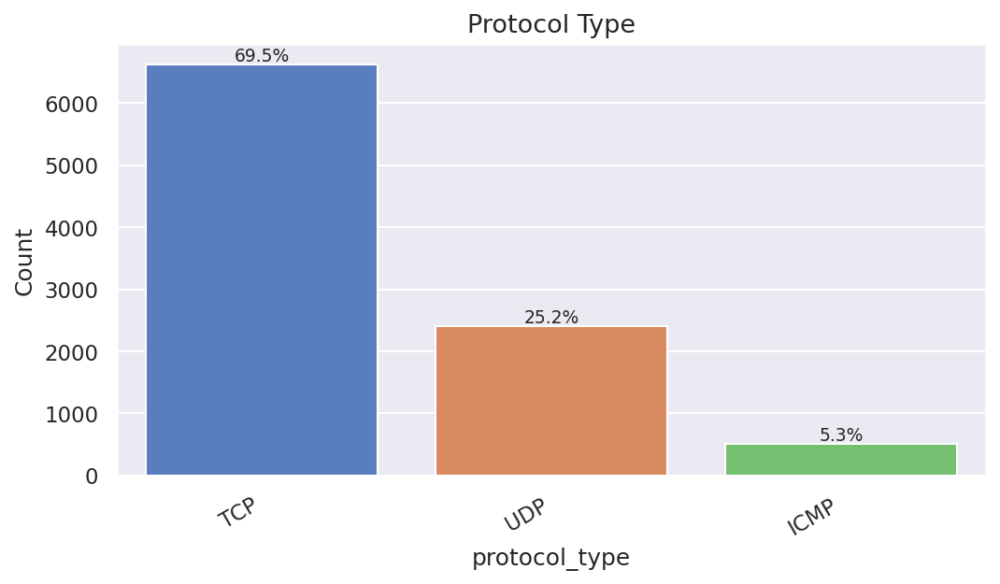
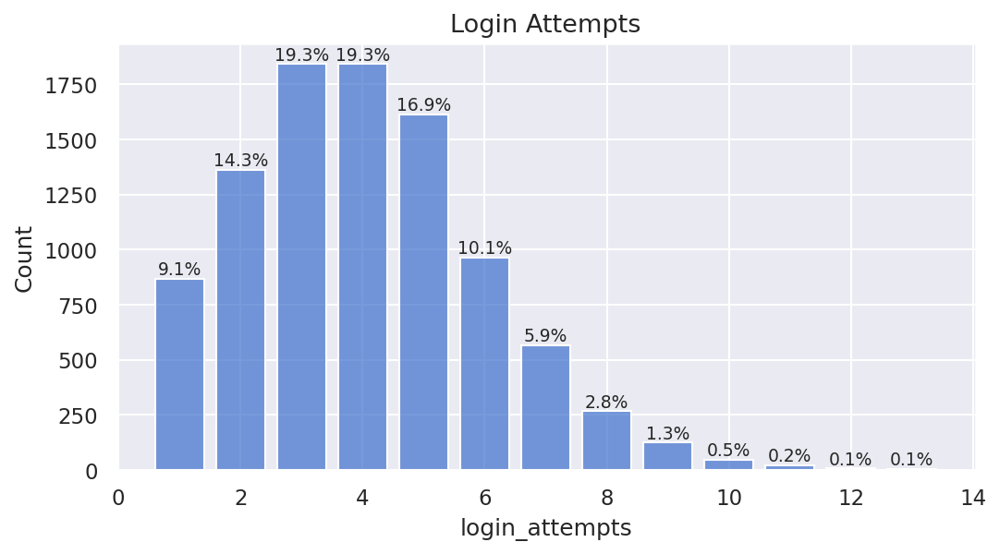
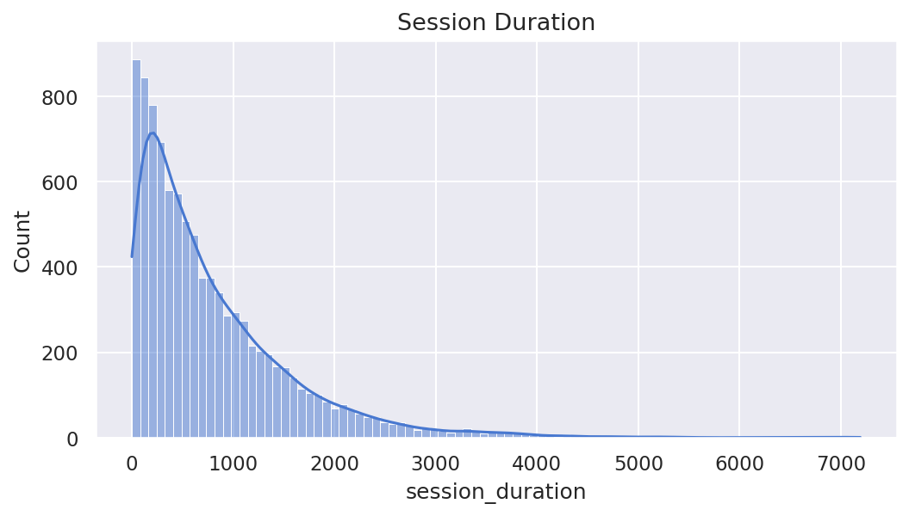
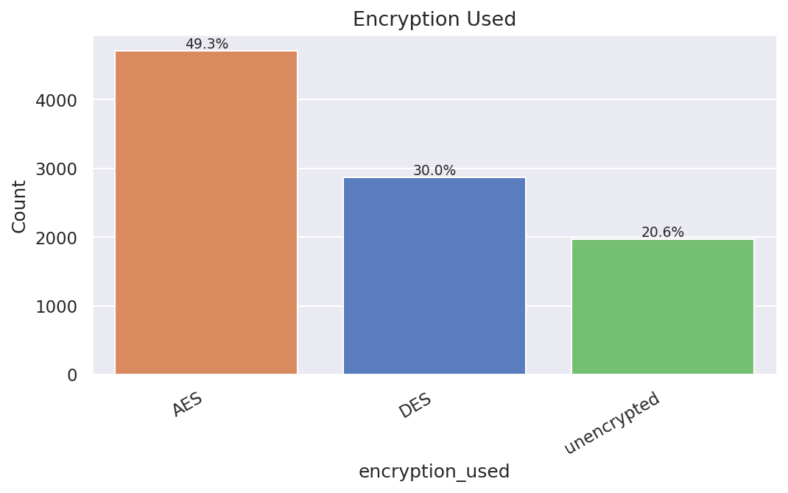
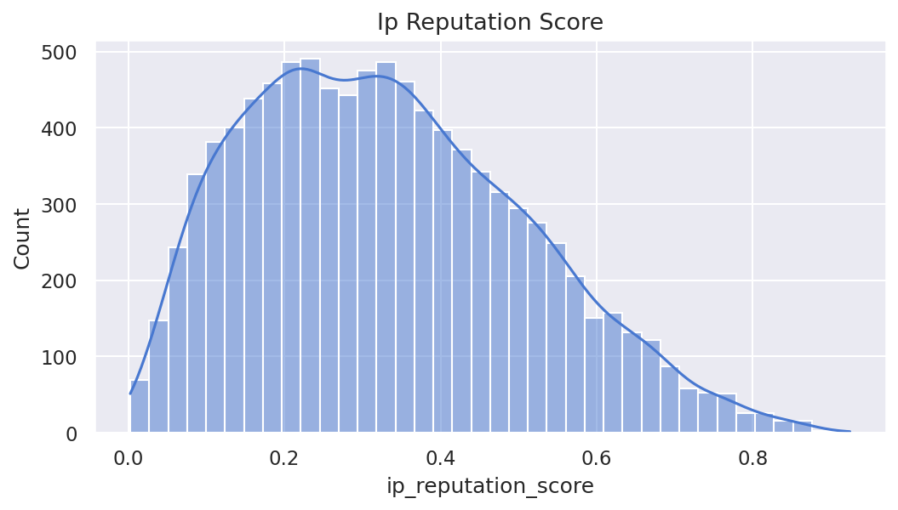
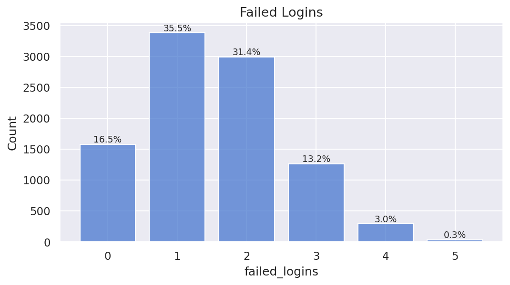
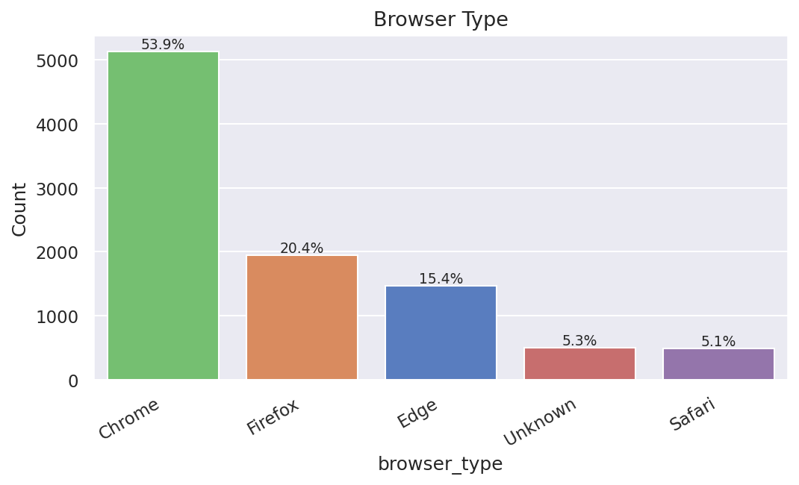
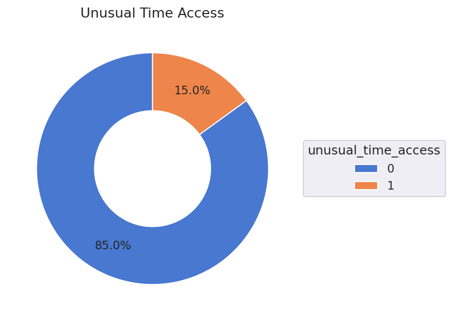
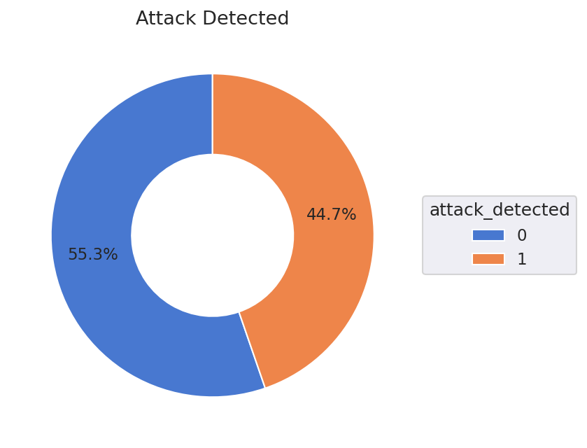

# Data Visualization Report

**Dataset:** `cybersecurity_intrusion_data.csv` — 9,537 rows, 11 columns

---

## Network Packet Size

| dtype | unique values | null count |
|-------|---------------|------------|
| `int64` | 959 | 0 (0.0%) |

---

## Protocol Type

| dtype | unique values | null count |
|-------|---------------|------------|
| `str` | 3 | 0 (0.0%) |

---

## Login Attempts

| dtype | unique values | null count |
|-------|---------------|------------|
| `int64` | 13 | 0 (0.0%) |

---

## Session Duration

| dtype | unique values | null count |
|-------|---------------|------------|
| `float64` | 9532 | 0 (0.0%) |

---

## Encryption Used

| dtype | unique values | null count |
|-------|---------------|------------|
| `str` | 3 | 0 (0.0%) |

---

## Ip Reputation Score

| dtype | unique values | null count |
|-------|---------------|------------|
| `float64` | 9537 | 0 (0.0%) |

---

## Failed Logins

| dtype | unique values | null count |
|-------|---------------|------------|
| `int64` | 6 | 0 (0.0%) |

---

## Browser Type

| dtype | unique values | null count |
|-------|---------------|------------|
| `str` | 5 | 0 (0.0%) |

---

## Unusual Time Access

| dtype | unique values | null count |
|-------|---------------|------------|
| `int64` | 2 | 0 (0.0%) |

---

## Attack Detected

| dtype | unique values | null count |
|-------|---------------|------------|
| `int64` | 2 | 0 (0.0%) |

---
